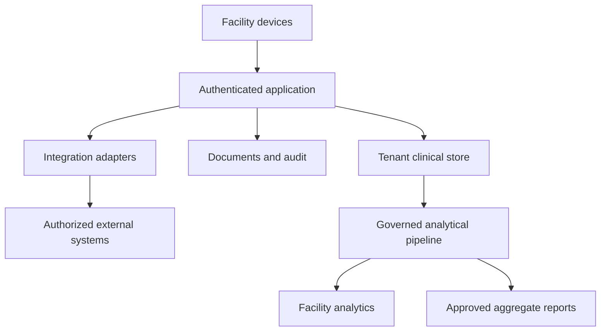

# Complete project report

**Proposed Andhra Pradesh & Telangana Health Data Platform**  
Prepared for Chakravarthi · Version 0.1.0 · 19 September 2026

## 1. Executive decision

Build a commercial clinical-workflow and interoperability platform for a tightly defined group of private facilities, then expand into a governed regional health-data network. The immediate value proposition is faster retrieval of patient history, dependable consultation records, laboratory result tracking and follow-up management. Revenue should initially come from facility subscriptions and implementation services.

Begin with adult outpatient care, including diabetes and hypertension follow-up, at five clinics, two small hospitals and one laboratory. The hospitals initially use the outpatient module; this does not include a complete inpatient hospital information system. The pilot location should follow the founder's strongest hospital relationships and available local implementation support. A Telangana cluster and an Andhra Pradesh cluster are expansion options, not selected or contracted locations.

The deliverable in this repository is a complete planning baseline. Application code, clinical validation, sales, incorporation, ABDM production access and legal approvals remain future work. A technically functional prototype alone cannot establish readiness to handle live clinical records.

## 2. Problem and evidence boundary

India already has mechanisms for health-data collection. The Ministry of Health and Family Welfare's [HMIS portal](https://hmis.mohfw.gov.in/) supports data entry, reporting and facility information. It would be inaccurate to describe India as having no hospital data-capture mechanism. The commercial hypothesis is that a selected group of facilities has incomplete clinical documentation, fragmented records or costly interfaces. Its prevalence in the proposed districts has not yet been measured.

Interview and observe facilities before claiming a market gap. Distinguish four problems: no electronic records, electronic billing with limited clinical records, a clinical system with poor usability, and a capable existing system with missing interoperability. Each requires a different product or integration service. Do not assume a large hospital wants to replace its current software.

Population coverage also needs precision. Records from participating private facilities describe those facilities' patients. They do not measure disease prevalence across an entire state. Public-health estimates require suitable sampling, denominators, coverage information and epidemiological review.

## 3. Objectives and measurable value

| Objective | Proposed pilot measure | Evidence |
|---|---|---|
| Improve documentation | At least 90% of eligible encounters have required fields or a valid missing-data reason | Weekly completeness audit |
| Limit clinician burden | Median incremental documentation time no more than 2 minutes for the agreed visit type | Timed observation against baseline |
| Improve result tracking | At least 95% of imported results link to the correct order or enter a visible exception queue | Reconciliation report |
| Support continuity | Previous authorized visit can be retrieved during a repeat consultation | Observed workflow test |
| Establish adoption | At least 80% of eligible visits captured at each retained pilot facility | Register-to-platform comparison |
| Test commercial demand | At least five of eight pilot sites sign a paid continuation agreement | Signed agreement and payment |
| Protect patients | No unresolved critical clinical-safety or security defect at launch | Independent review and clinical sign-off |

These are proposed gates, not achieved outcomes. Clinical improvement or reduction in admissions cannot be claimed from a short software pilot without an appropriate study.

## 4. Product scope

The MVP includes facility setup; role-based access; patient registration; voluntary ABHA linkage when integration is ready; consultation records; allergies and vital signs; clinician-approved prescriptions; laboratory orders and reviewed results; follow-up tasks; authorized record export; operational dashboards; and security/audit functionality. The interface supports Telugu and English. Medical content and translations require clinician review.

Use structured templates and fast selection before voice transcription. Voice can be tested later with informed handling of recordings and review of every generated clinical note. OCR can assist with historical documents, but extracted text remains unverified until reviewed. Neither voice nor OCR may independently finalize a prescription, diagnosis or result.

Defer inpatient wards, ICU charting, anesthesia, imaging archives, insurance adjudication, full pharmacy inventory, autonomous clinical decision support and research recruitment. Basic billing integration is preferable to building a full accounting system during the pilot. Adult outpatient scope also reduces the initial complexity of guardianship workflows; age must be checked and under-18 patients handled outside the pilot module until that workflow is approved.

At scale, add specialty modules only after a paying sponsor and clinical owner approve the business case. Expand to maternity, pediatrics and other specialties with new datasets and safety assessments rather than copying adult templates.

## 5. Clinical workflow and capture responsibility

1. Reception registers or finds the patient, confirms identity and explains the notice in the preferred language.
2. A nurse records observed vital signs and history within their role.
3. The clinician reviews history, records assessment and approves the encounter and prescription.
4. The laboratory receives an order identifier, records specimen status and releases an authorized result.
5. The clinician or delegated care team reviews the result and assigns follow-up.
6. The patient receives an authorized printout or secure access link.
7. The facility reviews completeness, missing results and upcoming follow-ups.

Each field has an accountable source. Unknown allergy status must remain different from “no known allergies.” A scanned prescription is a document, not automatically a verified medication list. Repeated family phone numbers must not cause patient records to be merged.

Capture once within normal work. Integrate existing laboratory or hospital systems when feasible. Historical migration is limited to agreed active-patient data and required documents; digitizing every old paper file is a separate priced project.

## 6. Platform design

Use a modular application with a relational clinical store, object storage for documents, a background-job service and a separately governed analytics store. PostgreSQL is a proposed database choice that suits the founder's experience; exact versions, service tiers and providers are selected during implementation.

For the pilot, favor managed hosting and managed database recovery. Keep the database private, put authenticated APIs in front of it and enforce tenant boundaries on every path, including exports and background jobs. Separate development, testing and production accounts. GitHub stores code and synthetic fixtures, never production data.

Offline operation is a bounded capability: encrypted local cache on managed devices, short session lifetime, restricted cached records, visible unsynchronized changes and safe conflict handling. An offline device cannot know that remote permissions were just revoked. Limit offline authorization windows and block new external sharing until connectivity restores policy checks. Unsynchronized records on a lost device can be lost; communicate this explicitly in the pilot procedure.

A regional network must preserve who created a record, who can access it and the purpose of each use. Creating a shared database does not create permission for all hospitals to view every patient.

## 7. Interoperability strategy

The [NRCeS ABDM implementation guide](https://nrces.in/ndhm/fhir/r4/index.html) defines exchange profiles using FHIR R4. Design an adapter between the internal model and the selected exchange profiles. Keep source data and mapping versions so failed mappings can be corrected without losing the original record.

Register and test with the relevant ABDM sandbox services before seeking production access. Internal consent records, ABDM exchange authorization and any regulated Consent Manager role are separate concepts. Do not describe the product as ABDM-certified or approved without the corresponding evidence.

Government reporting, insurance claims and laboratory device connectivity are separate integrations with separate access agreements. An ABHA number does not itself authorize downloading a person's records or conducting research. Integration availability, costs, version compatibility and vendor permissions must be confirmed in discovery.

## 8. Governance, privacy and security

Map purposes and decision makers before processing live data. For a facility's clinical operation, the facility may determine the purpose while the platform acts on its instructions. If the company independently determines a secondary analytical purpose, its responsibilities may change. Counsel must confirm the legal roles for each arrangement.

The [government's November 2025 DPDP announcement](https://www.pib.gov.in/PressReleasePage.aspx?PRID=2190014) confirms notification of the Rules and an 18-month phased implementation. This report does not establish a provision-by-provision commencement schedule. Verify current Gazette notifications and applicable transitional obligations before launch; do not treat all provisions as already commenced merely because the Rules were announced.

Proposed controls include purpose-limited collection, understandable notices, consent records where required, correction and grievance handling, contractual processor obligations, access reviews, encryption, auditability and a documented retention schedule. Withdrawal of a sharing permission must stop future sharing under that permission; it does not automatically erase records subject to a valid legal retention obligation.

Keep hosted clinical data and primary operating staff access in India as a proposed launch baseline. That architecture is not a claim that Indian law universally requires every category of health data to remain in India. Review backups, support access, analytics, messaging and AI subprocessors individually.

Research access must have a defined question, authorization, documented lawful basis, appropriate ethics review and an approved output process. Pseudonymized data remains potentially identifiable. Removal of names alone does not establish anonymity. Begin commercial analytics with facility-authorized operational reports and aggregate outputs; do not budget for identifiable-record sales.

## 9. Market and commercial strategy

The buyer is usually the facility owner or administrator; the daily users are clinical staff. Success requires both purchasing approval and clinician adoption. Run a discovery cohort of 20 facilities, five observed workflows and three written expressions of interest before committing to a full build.

Price hypotheses used for discovery are ₹3,000 per clinic per month, ₹18,000 per small hospital outpatient deployment and ₹8,000 per laboratory. These are not market quotes or full-HIS prices. At a hypothetical 60%/30%/10% mix, the average is ₹8,000 per facility per month. Installation averages ₹20,000 in the model; integration-heavy deployments require a separate statement of work.

Sell outcomes that can be demonstrated: fewer missing reports, faster history retrieval, more reliable follow-up lists and lower reporting effort. Offer clear limits on users, storage, imports, visits, on-site training and support. Prevent extensive custom development from being hidden inside a low subscription.

Do not claim an addressable market by multiplying both states' population by a fee. Build a deduplicated facility list, identify suitable workflows, establish reachable buyers and estimate conversion. The numerical customer paths in the financial model are scenarios, not verified market capacity.

For government expansion, treat eligibility, procurement, technical qualification, security requirements, payment milestones and support commitments as a separate business plan. No state endorsement or government revenue is assumed in the base model.

## 10. Team and operating model

Chakravarthi can own product sponsorship, data-platform design and delivery oversight. The project still needs an India-based clinical lead and facility implementation capability. Budget for founder time rather than assuming unlimited unpaid work.

A lean build team combines a technical lead/backend engineer, application engineer, QA/implementation specialist, part-time clinician, part-time design support, security advice and legal review. At 50–100 facilities, add dedicated customer success, integration engineering and on-call coverage. At regional scale, introduce district implementation leads, data stewardship, clinical governance, finance/procurement and a security operations arrangement.

Hiring numbers must follow measured implementation hours, ticket volume and service commitments. A five-person team cannot honestly promise unrestricted 24-hour on-site hospital support across two states.

## 11. Delivery and investment gates

| Stage | Indicative timing | Release or decision | Proposed funding envelope |
|---|---|---|---|
| Discovery | Weeks 1–6 | Validated workflow, buyer and pilot agreements | ₹3–5 lakh planning cap |
| Synthetic prototype | Weeks 7–12 | End-to-end workflow usability evidence | ₹8–15 lakh incremental planning range |
| Production pilot preparation and operation | Months 4–12 | Eight-site validation and paid continuation | Use first-year model and reserve |
| Repeatable district rollout | Months 13–24 | Standard onboarding and measured unit economics | Reforecast after pilot |
| Two-state commercial network | Months 25–60 | Replicable clusters, approved analytics and service capacity | Release investment by measured gates |

These are overlapping descriptions of work, not additional amounts to add to the five-year model. Discovery and prototype spending must be allocated within the model's salary, overhead, professional-services and equipment envelopes. If supplier quotations exceed those envelopes, update the model before approval.

The earlier conversation's ₹60 lakh–₹1.2 crore pilot and ₹8–₹20 crore state-scale ranges were preliminary illustrations. They were not quotations and are superseded for planning by the explicit model in this repository. A statewide public-sector rollout cannot be responsibly priced until facility count, scope, interfaces, hardware and service obligations are known.

## 12. Financial feasibility

Read the [generated five-year scenario results](finance/RESULTS.md) alongside [assumptions](finance/ASSUMPTIONS.md). The model calculates customers and cash monthly rather than multiplying a year-end customer count by twelve. It includes churn, half-month revenue for new facilities, bad-debt allowance, delayed collection, acquisition, onboarding, ongoing direct service costs, fixed operating expense and capital purchases.

<!-- FINANCIAL_SUMMARY_START -->
All amounts below are **INR crore**, generated from the same model. These are hypothetical scenarios.

| Scenario | Year 5 revenue | Year 5 EBITDA | First positive annual EBITDA | Funding including 20% buffer |
|---|---:|---:|---|---:|
| Downside | 4.30 | -2.23 | None in five years | 9.58 |
| Base | 9.54 | 0.96 | Year 5 | 4.26 |
| Upside | 15.87 | 4.82 | Year 3 | 2.54 |

Base first-year gross cash spending is **₹92.13 lakh**; modeled collections reduce first-year net outflow to **₹78.83 lakh**. Even with positive Year 5 EBITDA, the base case ends the five years with cumulative pre-financing cash flow of **₹-2.76 crore**; the original investment has not yet been recovered.
<!-- FINANCIAL_SUMMARY_END -->

Recurring subscription revenue is distinguished from setup fees. Annual recurring revenue is a year-end run rate, not recognized revenue for that year. Operating result is modeled EBITDA after a bad-debt allowance; it excludes tax, interest, depreciation and amortization. It is not owner take-home profit. Cash flow subtracts capital purchases and reflects collection timing.

Run downside, base and upside cases. Also examine the base case at 20% lower subscription pricing and 50% higher direct support costs. The minimum funding estimate is the peak cumulative monthly cash deficit plus a 20% planning buffer. This is a floor within the modeled assumptions, not a complete funding commitment or valuation.

Enterprise analytics, government contracts, grants, insurance commissions and pharmaceutical studies contribute zero forecast revenue. Add such revenue only after establishing contractual access rights, deliverables, delivery cost and payment timing. A research revenue line cannot be justified simply by accumulating records.

## 13. Expansion capacity and economics

For a scale illustration, 500 participating facilities at 60 encounters a day and 26 days a month generate 780,000 encounters a month. At a hypothetical 20 KB of structured payload per encounter, that is about 15.6 GB before indexes, replicas, logs and backups. At one 1 MB attachment for every five encounters, documents add about 156 GB a month. These are sizing assumptions, not measured workloads; imaging and audio could increase storage dramatically.

Validate query patterns, concurrent users, sync bursts, retention and export workloads before buying infrastructure. People, integration and adoption can dominate costs even when database storage is modest. Charge for unusually high document, messaging, on-site support and migration consumption through transparent contract limits.

State expansion should follow repeatable clusters: local clinical champion, reference sites, training capacity, data-quality measurement and renewal evidence. Select the second state only after the first cluster can onboard without daily founder intervention.

## 14. Failure conditions and decisions

Pause expansion if documentation consumes too much clinician time, less than 80% of eligible visits are captured, sites refuse paid continuation, direct service costs erase contribution margin or serious safety/privacy issues remain unresolved. Investigate whether the viable business is an integration service, a narrower specialty module or a facility-owned reporting tool.

Decisions still required from the owner are the initial district, available capital, local clinical partner, legal entity, founder involvement and the willingness to focus on adult outpatient scope. They do not prevent documenting or prototyping with synthetic data. Live operations require executed facility agreements, approved data handling and clinical sign-off.

## 15. Immediate next milestone

Produce a pilot-ready requirements baseline from actual hospital observations. The first software acceptance demonstration should show two distinct facilities, safe patient identification, a reviewed consultation, a finalized prescription, a result exception queue, a follow-up list, a denied cross-facility access attempt and a tested export. Demonstrate offline draft recovery with synthetic data before any pilot launch.

The supporting specifications in `docs/` define the detailed requirements, tests, risks and responsibilities needed to move from this report to implementation.
