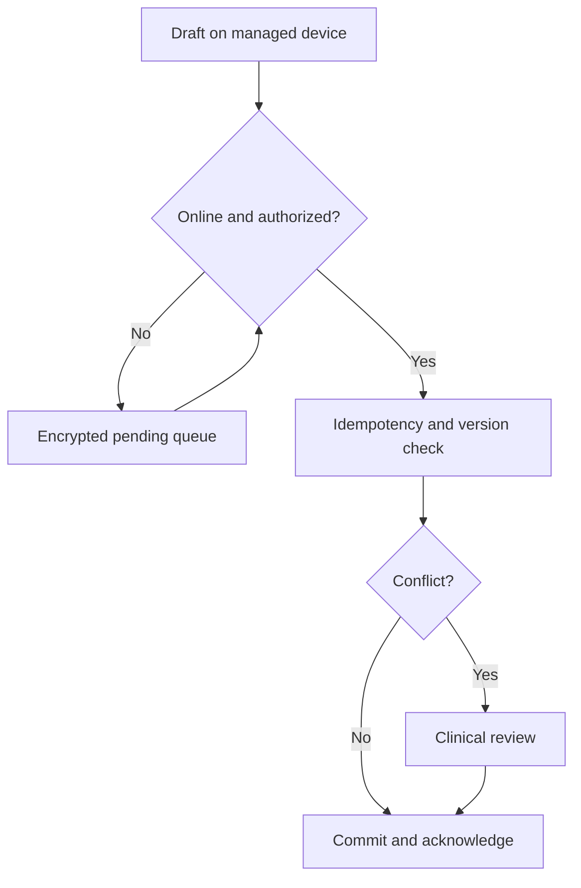

# Architecture and technical decisions

All components are proposed. The repository does not contain a deployed application.

## Deployment baseline

Use an India-region cloud deployment with a managed PostgreSQL service, private database networking, encrypted object storage, application containers, queue workers and a secrets manager. Start as a modular monolith with separately controlled workers; introduce service boundaries when load or team ownership justifies them. Kubernetes, distributed SQL and multi-region active/active writes are not pilot prerequisites.

Modules: facility/identity, patient registry, encounter/prescription, orders/results, notice/permission, export, audit, synchronization, integration and analytics. A common API authorization layer authenticates the user, derives facility membership from the server and checks patient/record access. Never trust a client-supplied tenant ID alone.

## Tenant isolation

Every tenant-owned table has a tenant identifier. Composite foreign keys include it, so an encounter cannot accidentally reference a patient from another tenant. Use application authorization plus PostgreSQL row-level policies where appropriate. The application role must not be a superuser or a role that bypasses those policies. Background workers, support tools, analytics extracts and signed object URLs follow the same scope checks.

At larger scale, move groups of tenants to separate databases or deployments through a controlled routing layer. Offer dedicated deployments only when contract value covers their operating cost. Test restoration of one tenant without exposing another tenant's data.

## Identity

Keep a facility-local patient key and separate identifier records with issuer and verification status. Do not use a phone number as a unique person key. Cross-facility linkage requires an authorized mechanism and confirmation; demographic similarity only creates a review candidate. Merge operations retain both identities, reason, reviewer and reversal history.

Users can have roles in multiple facilities, but switching facility changes authorization context. Administrative membership is not blanket permission to read clinical charts. Patient access must address shared family phones, identity recovery and changed numbers.

## Transaction integrity

Use transactionally written outbox records for work that follows a clinical database change. Workers deliver events at least once; consumers deduplicate by event ID and preserve ordering or reject stale revisions. Do not claim exactly-once delivery across independent systems.

All mutation endpoints accept a scoped idempotency key and request hash. Repeating an identical request returns the original result; reusing a key with different content fails. Use optimistic concurrency for record edits and append-only revisions for signed records.

## Bounded offline mode

Proposed pilot device policy: managed devices, encrypted local storage, explicit cache scope, eight-hour maximum offline authorization lease and a 24-hour target purge after successful synchronization. These are design defaults requiring privacy and clinical approval, not statutory periods. New external record sharing requires an online authorization check.

Lost-device controls cannot guarantee erasure while a device remains disconnected. Minimize local data, use operating-system encryption and device management, and document residual risk. Paper downtime records must be reconciled by named staff. A draft receipt is not proof of server durability.

## Analytics architecture

Maintain an access-controlled operational reporting layer for a facility's authorized users. Cross-facility analytics uses a separate approved pipeline with minimized fields, purpose metadata, disclosure checks and output logging. Keep identity mapping in a separate restricted service when linkage is required. Free text and attachments are excluded by default from shared analytical datasets.

Report the contributing sites, period, coverage, missingness, definition version and last refresh time. A change in participating facilities can look like disease growth; analysts must distinguish it. Do not run unrestricted cross-tenant analytical queries against production clinical tables.

## Proposed engineering choices

| Area | Starting choice | Revisit when |
|---|---|---|
| Backend | Python API framework selected by team | Benchmarks or hiring justify a change |
| Database | Supported PostgreSQL release, managed HA | Tenant count, workload or contracts need sharding/dedication |
| Client | Browser-based staff interface; managed offline client if required | Device/security discovery proves offline storage feasible |
| Infrastructure | Terraform modules and reviewed deployment pipeline | Provider or policy requirements change |
| Files | Object storage with restricted temporary access | Imaging archive scope is approved |
| Observability | Metrics, redacted traces and audit events | Service scale needs dedicated security tooling |
| Analytics | Separate reporting database initially | Large analytical workloads justify a warehouse |

Pin actual dependencies and verify support/security status at implementation. Recommendations here are architecture choices, not claims about current product pricing or feature availability.

## Capacity exercise

At 500 facilities × 60 encounters/day × 26 days/month, expect 780,000 monthly encounters under the example assumptions. For 10 working hours/day, the average is about 0.83 encounters/second; at 30 API actions/encounter this becomes about 25 requests/second before peaks, reads, integrations and retries. Benchmark at least a measured burst multiplier and realistic concurrent users, not this average alone.

Indexes, audit, revisions, attachments, retention and backups drive storage. Measure each separately. Backpressure and rate limits must protect clinical workflows during bulk imports and reconnect storms. Queue lag and oldest unsynchronized item age are first-class operational indicators.
